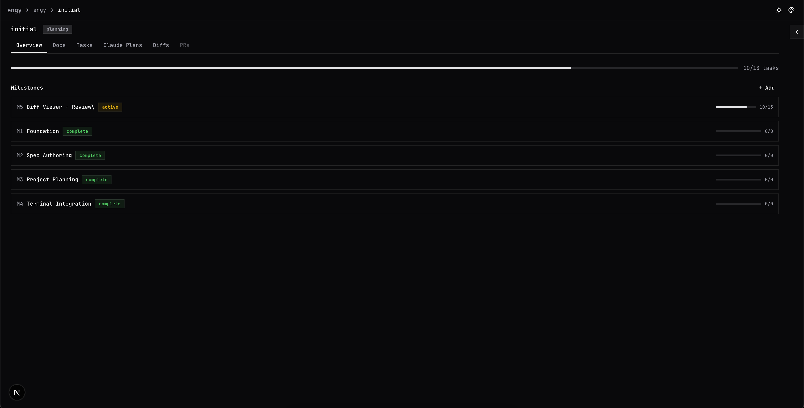
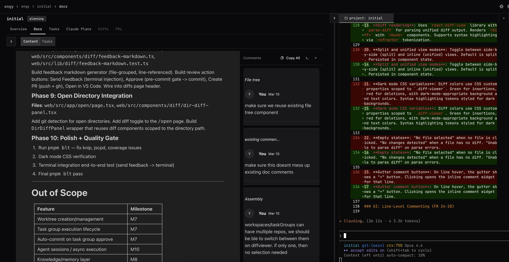
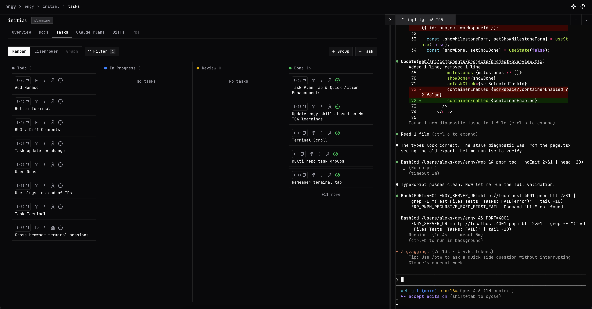
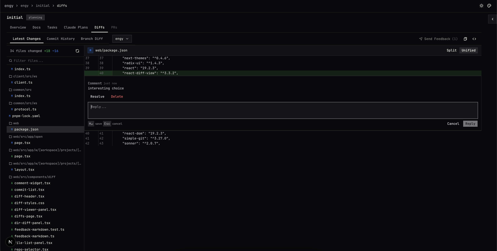
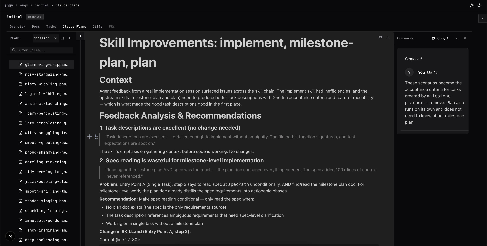
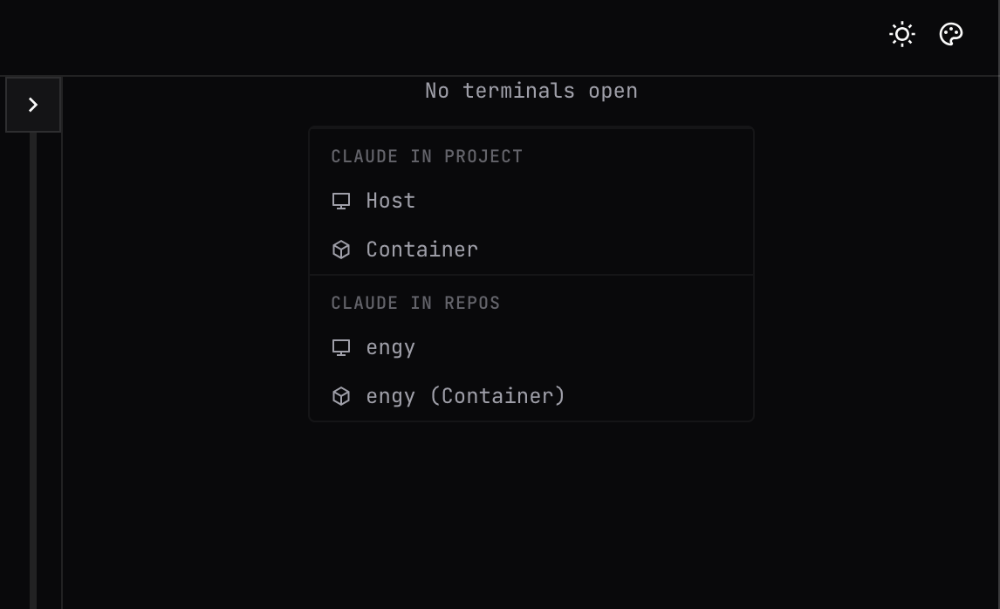

# Engy

**AI-assisted engineering workspace for spec-driven development.**

## What is Engy

Engy is a personal dev workspace for the **Specify → Plan → Execute → Complete** loop. Write specs, plan milestones, run AI agents against tasks, review diffs, and send inline feedback to Claude Code — all without leaving the app.

Everything is accessible to AI agents via a built-in MCP server, so Claude Code CLI running in your terminal can read and write Engy data directly.

## Features

### Project Planning & Management

Plan your projects and break them into milestones and task groups. Start implementing milestone, task groups or individual tasks with a single click (🔨 icon) while you continue working on other things.



### Spec Editor and Review

Rich text editor for writing and reviewing project plans. Supports headings, tables, lists, code blocks, and @ file mentions. Leave comments directly on any markdown file and send straight to a running Claude Code terminal session, so your AI agent gets feedback without you leaving the editor.



### Task Management

Three views for managing tasks:
- **Kanban** — Todo / In Progress / Review / Done columns
- **Eisenhower Matrix** — prioritize by urgency and importance
- **Dependency Graph** — visualize task dependencies across layers



### Diff Review & Inline Comments

Review uncommitted changes and branch diffs with line-level commenting. Leave inline comments on specific lines and send feedback directly to a running Claude Code session.

\

### Claude Plans

Review AI-generated plans and send structured feedback directly to a running Claude Code session.



### Built in Terminal

Engy has a built-in terminal that you can use to interact with Claude Code and manage your project. It persists across sessons and project pages, so you can keep your Claude Code agent running while you navigate around the app.



### DevContainers

Engy comes with a pre-configured DevContainer setup. Once enabled from Workspace settings it will create the necessary files in the `.devcontainer/` directory in the workspace root. You can customize the container configuration and post-start script as needed. The default setup includes strict firewall rules to allow communication between the container and the host machine and some default websites.

### MCP Server

Built-in Model Context Protocol server so AI agents (Claude Code CLI) can read specs, create tasks, and update project state directly.

### Workspaces

Permanent homes for ongoing concerns, tied to one or more repositories where Claude Code runs implementations. Additional repos can be added as extra directories. Organize projects, tasks, docs, and memory under one roof.

### Notifications

Get notified when a plan is ready for review or other events need your attention.

## Skills

Engy ships as a Claude Code plugin with skills that drive the full development loop from your terminal.

Install the marketplace:
```bash
/plugin marketplace add <cloned repo path>
```

Install the plugin.

Then you can run skills like:

| Skill | What it does |
|---|---|
| `/write-spec` | Create or validate an SRS from source documents |
| `/milestone-plan` | Break a spec into milestones, task groups, tasks, and dependencies |
| `/plan` | Write a plan for a single task |
| `/validate-plan` | Check a plan against its parent spec for alignment and gaps |
| `/implement` | Implement a single task |
| `/implement-milestone` | Orchestrate an entire milestone across task groups in parallel |
| `/review` | Code review with auto-detected scope and severity-tagged findings |
| `/workspace-assistant` | Quick task tracking — log bugs, create one-off work items |

## Getting Started

> **Work in progress — active development**
> Expect rough edges, missing features, and things that break.

**Prerequisites:** Node.js 20+, pnpm 10+

### Development

```bash
pnpm install

# Start both the web server and client daemon
pnpm dev
```

### Production

```bash
pnpm install
pnpm build


# Optionally set up environment
cp .env.example .env

# Uses .env if available, otherwise defaults
pnpm start
```

Open [http://localhost:3000](http://localhost:3000) (or whichever port you configured).

The `web/` server runs on the configured port. The `client/` daemon connects to it over WebSocket — it handles local filesystem access and git operations on your machine.

**Environment variables** (see `.env.example`):

| Variable | Default | Description |
|---|---|---|
| `PORT` | `3000` | Web server port |
| `ENGY_DIR` | `~/.engy/` | Data directory (SQLite DB + workspace dirs). Dev default: `.dev-engy/` |
| `ENGY_SERVER_URL` | `http://localhost:3000` | Server URL for the client daemon |

## Usage

### Create a Workspace

From the home page, click **+ New Workspace** and give it a name and slug. This is where Engy stores all the documents as git-trackable markdown. Workspaces also have their own **Tasks** tab for personal todos that live outside of any specific project. Workspaces can have one or more repositories. The 1st one will be Claude Codes working directory and others will be passed to Claude Code as additional directories.

### Create a Project

Inside a workspace, click **+ New Project**. A project is an ephemeral container for a specific initiative with its own spec, milestones, and tasks.

### Write Specs

Navigate to your project's **Docs** tab. Select or create a `spec.md` file to open the rich text editor. Collaborate with Claude and included Engy `/write-spec` skill to write your spec. Use **@ mentions** to reference files from the attached repositories. You can create a `spec.template.md` in the root of the workspace to use your own custom template for new specs.

### Plan Milestones

Once the spec is ready, use the `/milestone-plan` skill to break it down into milestones, task groups, and tasks. You can plan and implement one milestone at a time, or plan the entire project upfront. You can think of Task Groups as a single pull request's worth of work that will deliver some value. Smaller PRs make the human reviewers happy! When on `Overview` tab, click the 🔨 icon on a milestone or task group to start implementing all the associated tasks.  

### Manage Tasks

Use the project **Tasks** tab to create and organize tasks. Switch between three views: Kanban, Eisenhower, and Graph. Tasks have IDs (T-1, T-2...), types (`human` / `ai`), and status badges. Use **+ Group** to organize tasks into task groups within milestones.

All new tasks by default need a plan. Click on the document icon to start creating a plan for that task. Created plans will be in the `plans` directory and you can use `Docs` tab to view, edit and comment on them. Once a plan is ready, click the 🔨 icon to start implementing it with Claude Code.

### Connect Claude Code (MCP)

Engy exposes an MCP server at `/mcp` on the same port. To connect Claude Code CLI:

```bash
claude mcp add --transport http Engy http://localhost:3000/mcp --scope user
```

```json
{
  "mcpServers": {
    "engy": {
      "type": "sse",
      "url": "http://localhost:3000/mcp"
    }
  }
}
```

Add this to your `.mcp.json` (adjust the port if needed). Claude Code can then read specs, create tasks, update milestones, and manage project state.

## Architecture

pnpm monorepo with three packages:

```
web/      Next.js 16 + custom Node.js HTTP server
          ├── Frontend (App Router, React 19)
          ├── tRPC API (browser UI)
          ├── MCP server (AI agent access via Claude Code CLI)
          └── WebSocket server (private channel to client daemon)

client/   Node.js daemon — runs on your machine
          ├── Filesystem access (path validation, file watching)
          └── Git operations (branch info, status, worktrees)

common/   Shared TypeScript types only (WebSocket protocol)
```

**One port, three protocols.** The web server handles Next.js HTTP, WebSocket (`/ws`), and MCP SSE (`/mcp`) on a single port.

**Server never touches your repos directly.** It sends requests to the client daemon, which validates paths and responds. This lets the server run remotely while repos stay local.

**Data split.** SQLite holds execution state (workspaces, projects, tasks, memories). Your `.engy/` directory holds knowledge as git-trackable markdown files (specs, system docs, shared docs, memory).

## Tech Stack

| Layer | Technology |
|---|---|
| Framework | Next.js 16 (App Router), React 19 |
| API | tRPC v11 + superjson |
| AI access | MCP SDK (SSE transport) |
| Database | SQLite via Drizzle ORM + better-sqlite3 |
| Editor | BlockNote |
| UI | shadcn/ui, Tailwind CSS v4, JetBrains Mono |
| Testing | Vitest (90%+ coverage on server code) |
| Monorepo | Turborepo + pnpm workspaces |

## Development

```bash
pnpm dev          # Start web + client (loads .dev.env)
pnpm build        # Build all packages
pnpm test         # Run all tests
pnpm blt          # Pre-commit gate: build + lint + test + dead code checks
```

`pnpm blt` must pass before committing. It runs TypeScript compilation, ESLint, Vitest with coverage thresholds (90% statements on server code), knip (dead code), and jscpd (copy-paste detection).

Tests follow a BDD style (`describe > describe > it('should ...')`) with a Testing Trophy approach — integration tests covering full vertical slices are preferred over unit tests. Tests use real SQLite instances, no mocks for the database.
