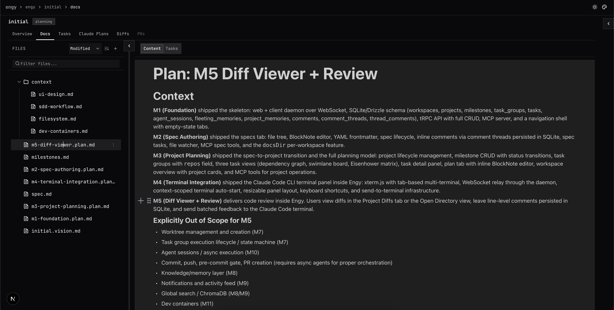
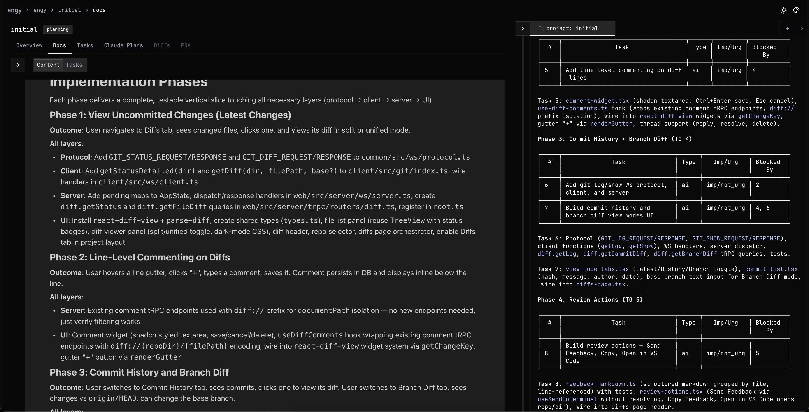

# Engy

**AI-assisted engineering workspace for spec-driven development.**

---

> **Work in progress — active development, fully vibecoded.**
> Expect rough edges, missing features, and things that break. This is being built in the open as a personal tool. Use at your own risk.

---

## What is Engy

Engy is a single-user workspace manager for spec-driven development. It gives you a permanent home for ongoing concerns (a codebase, a product, accumulated knowledge) and ephemeral execution scopes for bounded work (features, refactors, bug fixes).

The core loop: **Specify → Plan → Execute → Complete.** You write specs in Engy's editor, plan projects from approved specs, run AI agents against tasks, review diffs, and extract learnings back into your knowledge base — all without leaving the app.

Everything is accessible to AI agents via a built-in MCP server, so Claude Code CLI running in your terminal can read and write Engy data directly.


## Features

- **Workspaces** — permanent homes for ongoing concerns, tied to one or more repositories where Claude Code runs implementations. Additional repos can be added as extra directories. Organize projects, tasks, docs, and memory under one roof.
- **Projects & Milestones** — scoped execution for bounded work. Track milestones with status badges and progress bars.
- **Spec Editor** — rich text editor for writing and reviewing Software Requirements Specifications. Supports headings, tables, lists, code blocks, and @ file mentions.
- **Inline Comments** — leave comments directly on any markdown file (specs, plans, docs). Comments can be sent straight to an active terminal session, so your AI agent gets feedback without leaving the editor.
- **Task Management** — three views for managing tasks:
  - **Kanban** — Todo / In Progress / Review / Done columns
  - **Eisenhower Matrix** — prioritize by urgency and importance
  - **Dependency Graph** — visualize task dependencies across layers
- **Notifications** — get notified when a plan is ready for review or other events need your attention.
- **MCP Server** — built-in Model Context Protocol server so AI agents (Claude Code CLI) can read specs, create tasks, and update project state directly.
- **Dark & Light Mode** — toggle between themes.

## Getting Started

**Prerequisites:** Node.js 20+, pnpm 10+

### Development

```bash
pnpm install

# Set up environment
cp .env.example .dev.env
# Edit .dev.env if needed (defaults work for local dev)

# Start both the web server and client daemon
pnpm dev
```

### Production

```bash
pnpm install
pnpm build

# Uses .env if available, otherwise defaults
pnpm start
```

Open [http://localhost:3000](http://localhost:3000) (or whichever port you configured).

The `web/` server runs on the configured port. The `client/` daemon connects to it over WebSocket — it handles local filesystem access and git operations on your machine.

**Environment variables** (see `.env.example`):

| Variable | Default | Description |
|---|---|---|
| `PORT` | `3000` | Web server port |
| `ENGY_DIR` | `~/.engy/` | Data directory (SQLite DB + workspace dirs). Dev default: `.dev-engy/` |
| `ENGY_SERVER_URL` | `http://localhost:3000` | Server URL for the client daemon |

## Usage

### Create a Workspace

From the home page, click **+ New Workspace** and give it a name and slug. Link it to a local directory using **Open Directory** — this is where Engy stores knowledge files (specs, system docs, memory) as git-trackable markdown. Workspaces also have their own **Tasks** tab for personal todos that live outside of any specific project.

### Create a Project

Inside a workspace, click **+ New Project**. A project is an ephemeral scope for bounded work — a feature, refactor, or bug fix. Each project gets its own spec, milestones, tasks, and docs.

### Write Specs

Navigate to your project's **Docs** tab. Select or create a `spec.md` file to open the rich text editor. Write your Software Requirements Specification with headings, tables, lists, and code blocks. Use **@ mentions** to reference other files. Specs can be marked as `buildable` and tracked through `active` → `complete` status.



### Plan Milestones

On the project **Overview** tab, click **+ Add** to create milestones. Each milestone has a name, status (`planned` / `in_progress` / `complete`), and progress tracking.



### Manage Tasks

Use the project **Tasks** tab to create and organize tasks. Switch between three views:

- **Kanban** — drag tasks through Todo → In Progress → Review → Done
- **Eisenhower** — prioritize in a 2x2 matrix of urgency vs. importance
- **Graph** — see task dependencies visualized as a layered DAG

Tasks have IDs (T-1, T-2...), types (`human` / `ai`), and status badges. Use **+ Group** to organize tasks into task groups within milestones.


### Review Diffs

The **Diffs** tab shows uncommitted changes and branch diffs with line-level commenting. Leave inline comments on specific lines, and send feedback directly to a running Claude Code terminal session.


### Connect Claude Code (MCP)

Engy exposes an MCP server at `/mcp` on the same port. To connect Claude Code CLI:

```json
{
  "mcpServers": {
    "engy": {
      "type": "sse",
      "url": "http://localhost:3000/mcp"
    }
  }
}
```

Add this to your `.mcp.json` (adjust the port if needed). Claude Code can then read specs, create tasks, update milestones, and manage project state.

### Send Feedback to Claude Code

The **Claude Plans** tab lets you review AI-generated plans and send structured feedback directly to a running Claude Code session.


## Architecture

pnpm monorepo with three packages:

```
web/      Next.js 16 + custom Node.js HTTP server
          ├── Frontend (App Router, React 19)
          ├── tRPC API (browser UI)
          ├── MCP server (AI agent access via Claude Code CLI)
          └── WebSocket server (private channel to client daemon)

client/   Node.js daemon — runs on your machine
          ├── Filesystem access (path validation, file watching)
          └── Git operations (branch info, status, worktrees)

common/   Shared TypeScript types only (WebSocket protocol)
```

**One port, three protocols.** The web server handles Next.js HTTP, WebSocket (`/ws`), and MCP SSE (`/mcp`) on a single port.

**Server never touches your repos directly.** It sends requests to the client daemon, which validates paths and responds. This lets the server run remotely while repos stay local.

**Data split.** SQLite holds execution state (workspaces, projects, tasks, memories). Your `.engy/` directory holds knowledge as git-trackable markdown files (specs, system docs, shared docs, memory).

## Tech Stack

| Layer | Technology |
|---|---|
| Framework | Next.js 16 (App Router), React 19 |
| API | tRPC v11 + superjson |
| AI access | MCP SDK (SSE transport) |
| Database | SQLite via Drizzle ORM + better-sqlite3 |
| Editor | BlockNote |
| UI | shadcn/ui, Tailwind CSS v4, JetBrains Mono |
| Testing | Vitest (90%+ coverage on server code) |
| Monorepo | Turborepo + pnpm workspaces |

## Development

```bash
pnpm dev          # Start web + client (loads .dev.env)
pnpm build        # Build all packages
pnpm test         # Run all tests
pnpm blt          # Pre-commit gate: build + lint + test + dead code checks
```

`pnpm blt` must pass before committing. It runs TypeScript compilation, ESLint, Vitest with coverage thresholds (90% statements on server code), knip (dead code), and jscpd (copy-paste detection).

Tests follow a BDD style (`describe > describe > it('should ...')`) with a Testing Trophy approach — integration tests covering full vertical slices are preferred over unit tests. Tests use real SQLite instances, no mocks for the database.
